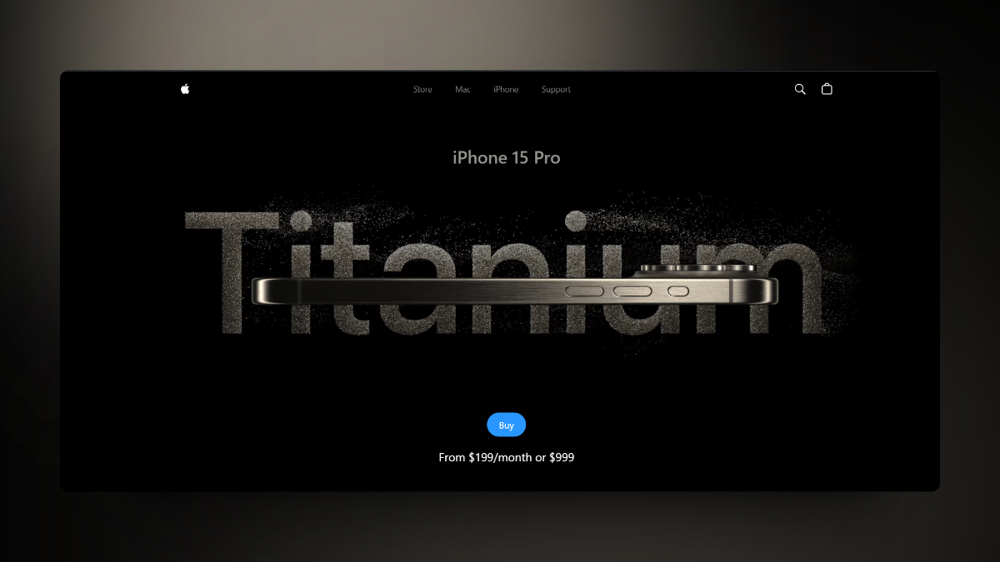

# iPhone 15 Website Page Design Recreation

This project aims to recreate the design of the iPhone 15 website page using Vite, React, Three.js, React Fiber, and React Drei.
## Preview

## Features

- Utilizes Vite for fast development and builds.
- Implements React for building the user interface.
- Utilizes Three.js for 3D rendering.
- Integrates React Fiber for improved performance.
- Utilizes React Drei for simplified 3D object management.

## Installation

1. Clone the repository: 
git clone https://github.com/igniteking/apple-website

2. Navigate to the project directory:
cd apple-website

3. Install dependencies:
npm install

## Usage
1. Start the development server:
npm run dev

2. Open your browser and navigate to `http://localhost:5173` to see the project running.

## Contributing
Contributions are welcome! Feel free to open issues or submit pull requests.

## License
This project is licensed under the MIT License - see the [LICENSE](LICENSE) file for details.

## Badges

